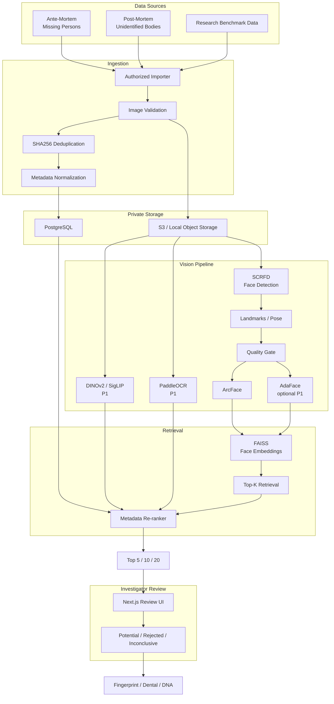
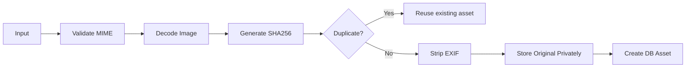
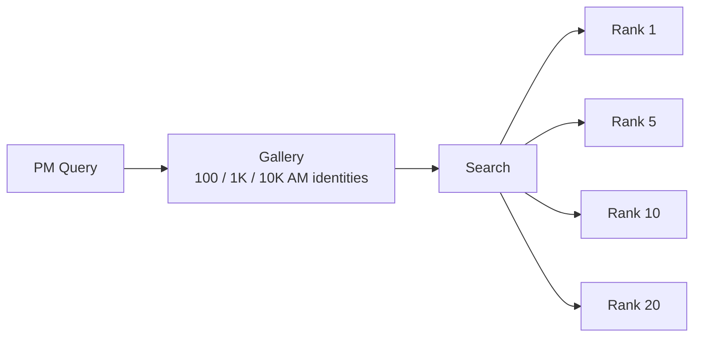
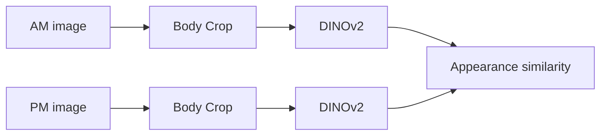
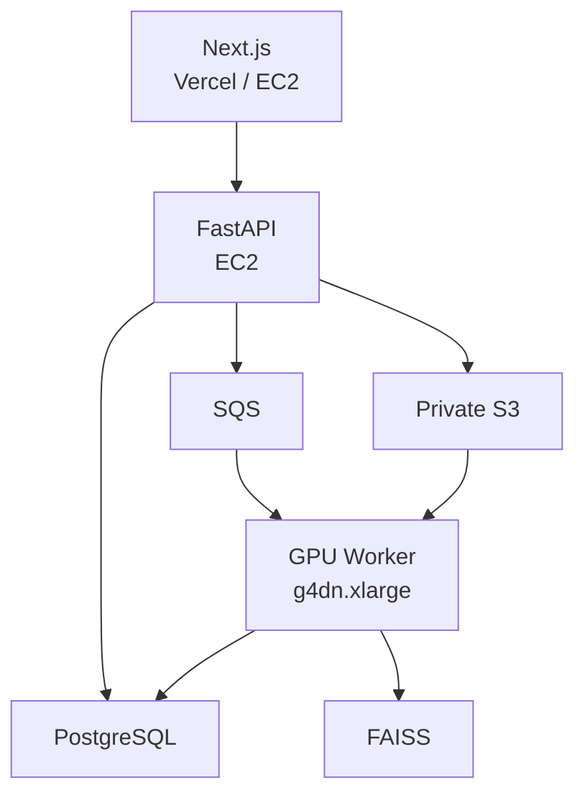

For a **working prototype**, I would build this as an **AI-assisted AM↔PM reconciliation system**:

* **AM (ante-mortem):** missing-person photos and metadata.
* **PM (post-mortem):** unidentified-body photos and metadata.
* AI retrieves **Top-K candidates**.
* A human examiner reviews them.
* Actual identification remains based on police/forensic evidence such as fingerprints, dental records, and DNA.

That is also consistent with INTERPOL's approach: facial-recognition systems return candidate lists for manual review, while DVI uses fingerprints, dental records and DNA as primary identifiers. ([Interpol][1])

---

# 1. Don't start by scraping the entire Nepal Police database

The Nepal Police UDB currently exposes separate missing-person and unidentified-body listings containing photographs and case metadata such as sex, age, missing/found location and dates. ([Nepal Police Database][2])

But creating face embeddings from those photographs creates a **new biometric database**.

Nepal's Privacy Act explicitly includes biometric information within personal information and places restrictions on collecting, storing, analysing and processing personal information without legal authority/consent. ([Law Commission Repository][3])

So build the system in two modes:

```text
MODE A — Prototype
Research / controlled / consented images

MODE B — Nepal Police Pilot
Authorized police export/API
or processing inside Nepal Police infrastructure
```

For the police pilot, request:

```text
Missing persons export
├── case identifier
├── name
├── age
├── sex
├── height
├── missing date
├── last-seen location
├── clothing description
├── distinguishing marks
└── image paths

Unidentified persons export
├── PM identifier
├── estimated age
├── sex
├── estimated height
├── recovery date
├── recovery location
├── current facility
├── clothing
├── marks/tattoos
└── image paths
```

Prefer a **CSV/JSON + private image archive/API** over scraping their public website.

---

# 2. Prototype architecture



---

# 3. Repository structure

Since you're using `uv`, keep all ML/backend code Python.

```text
dvi-match/
│
├── pyproject.toml
├── uv.lock
├── .python-version
├── .env.example
│
├── apps/
│   ├── api/
│   │   └── main.py
│   │
│   ├── worker/
│   │   └── main.py
│   │
│   └── web/                     # Next.js
│       ├── app/
│       ├── components/
│       └── package.json
│
├── src/
│   └── dvi/
│       ├── config.py
│       │
│       ├── ingestion/
│       │   ├── manifest.py
│       │   ├── validator.py
│       │   ├── deduplicate.py
│       │   └── police_import.py
│       │
│       ├── vision/
│       │   ├── detector.py
│       │   ├── alignment.py
│       │   ├── quality.py
│       │   ├── arcface.py
│       │   ├── adaface.py
│       │   └── appearance.py
│       │
│       ├── retrieval/
│       │   ├── faiss_index.py
│       │   ├── search.py
│       │   └── reranker.py
│       │
│       ├── database/
│       │   ├── models.py
│       │   └── repository.py
│       │
│       └── storage/
│           ├── local.py
│           └── s3.py
│
├── scripts/
│   ├── import_dataset.py
│   ├── process_images.py
│   ├── build_index.py
│   ├── evaluate.py
│   └── benchmark.py
│
├── data/
│   ├── manifests/
│   └── development/
│
└── tests/
```

---

# 4. Set up `uv`

Start:

```bash
mkdir dvi-match
cd dvi-match

uv init --package
```

Python:

```bash
uv python pin 3.12
```

Backend dependencies:

```bash
uv add \
  fastapi \
  "uvicorn[standard]" \
  pydantic \
  pydantic-settings \
  sqlalchemy \
  "psycopg[binary]" \
  boto3 \
  python-multipart
```

Vision:

```bash
uv add \
  numpy \
  pillow \
  opencv-python-headless \
  insightface \
  onnxruntime \
  faiss-cpu
```

Development:

```bash
uv add --dev \
  pytest \
  ruff \
  mypy \
  httpx
```

Initially **do not install every model we've discussed**.

P0 should only contain:

```text
InsightFace/SCRFD
ArcFace
basic quality metrics
FAISS
```

---

# 5. Define one normalized data contract

This is important because eventually your source may change from:

```text
research dataset
      ↓
CSV
      ↓
Nepal Police API
      ↓
police database
```

The ML code should not care.

Create:

```text
data/manifests/persons.csv
```

For AM:

```csv
record_id,record_type,name,sex,age_min,age_max,height_cm,event_date,location,image_path,source_ref
AM001,AM,Person-A,male,38,40,170,2026-08-26,Rasuwa,images/am001_1.jpg,TEST001
AM001,AM,Person-A,male,38,40,170,2026-08-26,Rasuwa,images/am001_2.jpg,TEST001
AM002,AM,Person-B,female,25,27,158,2026-08-25,Rasuwa,images/am002.jpg,TEST002
```

PM:

```csv
record_id,record_type,name,sex,age_min,age_max,height_cm,event_date,location,image_path,source_ref
PM001,PM,,male,35,45,168,2026-08-28,Devghat,images/pm001.jpg,PMTEST001
PM002,PM,,female,20,30,160,2026-08-28,Gaindakot,images/pm002.jpg,PMTEST002
```

---

# 6. Image ingestion

When an image enters the system:



Validate:

```text
JPEG / PNG / WebP only
maximum file size
actual image decode succeeds
reasonable dimensions
no path traversal
SHA256 generated
EXIF stripped from working copy
```

Do **not** overwrite originals.

Keep:

```text
original
processed
face crop
thumbnail
```

separate.

---

# 7. Database schema

You only need approximately six core tables initially.

### `persons`

```text
id
external_id
type                AM | PM
name
sex
age_min
age_max
height_cm
event_date
location_text
latitude
longitude
source
created_at
```

### `images`

```text
id
person_id
storage_key
sha256
width
height
image_type
created_at
```

### `faces`

```text
id
image_id
bbox_x1
bbox_y1
bbox_x2
bbox_y2

detector_score

yaw
pitch
roll

blur_score
quality_score

usable
failure_reason
```

### `embeddings`

```text
id
face_id
model
model_version
dimension
embedding
created_at
```

For P0, embedding can live in FAISS and PostgreSQL only stores the FAISS ID.

### `candidate_matches`

```text
id

query_person_id
candidate_person_id

face_score
metadata_score
final_score

rank
model_version

created_at
```

### `reviews`

```text
candidate_match_id
reviewer_id

decision
potential
rejected
inconclusive

notes
reviewed_at
```

---

# 8. First vision implementation: InsightFace

Don't separately integrate five libraries initially.

InsightFace gives you detection + landmarks + embeddings reasonably quickly.

Conceptually:

```python
from insightface.app import FaceAnalysis

app = FaceAnalysis(
    name="buffalo_l",
    providers=["CPUExecutionProvider"],
)

app.prepare(
    ctx_id=-1,
    det_size=(640, 640),
)
```

Then:

```python
faces = app.get(image)
```

For each face extract:

```text
bbox
detection score
landmarks
embedding
```

Store the model/version used with every vector.

That matters because when you upgrade models later, embeddings from two incompatible models should **not be silently mixed**.

---

# 9. Quality gate

Before matching:

```text
face width >= minimum
face height >= minimum
detector confidence sufficient
blur acceptable
pose acceptable
landmarks present
embedding generated
```

Example response:

```json
{
  "usable": false,
  "reason": "severe_occlusion",
  "detector_score": 0.61,
  "blur_score": 0.31
}
```

For post-mortem images, **`inconclusive` is a valid result**.

Do not force every photograph through recognition.

That is particularly important because post-mortem recognition can fail at image enrolment itself. A 2024 DVI study found that image suitability significantly affected recognition performance and reported a correct candidate in the Top-20 about 71% of the time in its evaluated setting—not reliable enough for autonomous identification. ([ScienceDirect][4])

---

# 10. Build embeddings

For every usable face:

```text
AM001 image 1
    ↓
512-D vector

AM001 image 2
    ↓
512-D vector

AM001 image 3
    ↓
512-D vector
```

Don't initially average them.

Store multiple observations.

Normalize:

$$
\hat e = \frac{e}{||e||_2}
$$

Then cosine similarity becomes:

$$
S(x,y) = \hat x^\top \hat y
$$

---

# 11. Build FAISS index

Start with:

```python
faiss.IndexFlatIP(512)
```

Not IVF.

Not HNSW.

Not distributed FAISS.

For 10k–100k faces, exact search is completely reasonable for a prototype.

Structure:

```text
FAISS ID
     ↓
face_id
     ↓
image_id
     ↓
person_id
```

Store this mapping in PostgreSQL.

---

# 12. AM → PM search

The most natural flood workflow is:

```text
Unidentified PM body
        ↓
retrieve possible missing people
```

Query:

```text
PM embedding
      ↓
FAISS
      ↓
Top 100 individual AM photographs
      ↓
collapse by person_id
      ↓
Top 20 identities
```

If one missing person has five photographs, don't return them five times.

Aggregate:

$$
S_{person}(Q,P)=\max_i S(Q,E_{P,i})
$$

Initially `max()` is enough.

---

# 13. Add metadata re-ranking

Face similarity should retrieve candidates.

Metadata should re-rank them.

Use:

```text
sex compatibility
age compatibility
height compatibility
missing date
recovery date
last-seen location
recovery location
```

Start with transparent code, **not an LLM**.

For example:

```text
face                     0.72
age compatibility        0.90
height compatibility     0.95
time plausibility        0.90
location plausibility    0.75
```

But **don't invent fixed weights and call them scientifically valid**.

Start with heuristic weights only for experimentation, then learn/calibrate them from validation data.

Something simple:

$$
score =
w_f S_f +
w_a S_a +
w_h S_h +
w_t S_t +
w_g S_g
$$

Eventually logistic regression is preferable because you can inspect coefficients and calibrate probabilities.

---

# 14. Don't hard-filter demographics

For example, don't do:

```python
if estimated_age != missing_age:
    reject()
```

PM age estimation may be inaccurate.

Instead:

```text
difference 0–5 years   → strongly compatible
difference 5–10        → moderately compatible
difference >20         → lower ranking
```

Same philosophy for height.

These fields should **reduce or increase ranking**, not automatically determine identity.

---

# 15. P0 API

You only need about six endpoints.

```text
POST /persons/am
POST /persons/pm

POST /persons/{id}/images

POST /images/{id}/process

POST /pm/{pm_id}/search

GET /matches/{pm_id}

POST /matches/{match_id}/review
```

Search output:

```json
{
  "query": "PM001",
  "status": "candidate_results",
  "candidates": [
    {
      "rank": 1,
      "person_id": "AM042",
      "face_score": 0.74,
      "metadata_score": 0.82,
      "review_status": "unreviewed"
    },
    {
      "rank": 2,
      "person_id": "AM016",
      "face_score": 0.71,
      "metadata_score": 0.69,
      "review_status": "unreviewed"
    }
  ]
}
```

Do not return:

```json
{
  "identity": "AM042",
  "confidence": "99%"
}
```

That makes a much stronger claim than the model can justify.

---

# 16. Next.js UI

Build only four pages initially.

```text
/
├── /missing
├── /unidentified
├── /search/[pmId]
└── /review/[matchId]
```

### `/missing`

```text
+ Add AM record

Photo
Name
Age
Sex
Height
Location
Missing date
```

### `/unidentified`

For sensitive PM images:

```text
[ Sensitive image hidden ]

Reveal image
```

Don't make graphic images automatically visible throughout the UI.

### Search

```text
PM-008

Face quality: MODERATE
13 candidates found

#1 Candidate AM-103
#2 Candidate AM-004
#3 Candidate AM-391
...
```

### Review

```text
              AM                PM

          [ photo ]         [ reveal ]

Face candidate rank             #2
Age                        compatible
Height                     compatible
Location                   plausible
Time                       plausible

[ Potential Candidate ]
[ Reject ]
[ Inconclusive ]
```

---

# 17. Add audit logging immediately

Because this involves highly sensitive data, log:

```text
who viewed PM photograph
who performed search
which record was searched
which candidates were viewed
who made review decision
when it happened
model version
```

Do **not** log embeddings, full API payloads or photographs into application logs.

---

# 18. Build the evaluation set separately

Never measure performance using the same identities/images that influenced your thresholds.

Create:

```text
data/
├── train/
├── validation/
└── test/
```

Split by **identity**, not image.

Wrong:

```text
Person A image 1 → train
Person A image 2 → test
```

Correct:

```text
Person A → train only
Person B → validation only
Person C → test only
```

---

# 19. Prototype evaluation

For each test identity:



Measure:

### Primary

```text
Recall@1
Recall@5
Recall@10
Recall@20
```

If there are 100 genuine query identities and the correct identity occurs within Top-20 for 78:

$$
Recall@20 = 78\%
$$

### Also record

```text
failure-to-detect
failure-to-enrol
false matches
quality rejection rate
query latency
processing latency
```

Don't headline:

> **98.2% accuracy**

That number is usually misleading for this type of retrieval system.

---

# 20. Stress-test the face pipeline

Take controlled AM images and generate copies containing:

```text
JPEG compression
motion blur
Gaussian blur
low resolution
dark exposure
partial occlusion
rotation
crop
mud-like masking
```

Then evaluate separately:

| Condition      | R@1 | R@5 | R@20 | Failure rate |
| -------------- | --: | --: | ---: | -----------: |
| Clean          |     |     |      |              |
| Low resolution |     |     |      |              |
| Blur           |     |     |      |              |
| Occlusion      |     |     |      |              |
| Strong pose    |     |     |      |              |
| Combined       |     |     |      |              |

This tells you **where the system breaks**.

---

# 21. Then add AdaFace

Only after ArcFace baseline exists.

Run exactly the same test:

```text
ArcFace
vs
AdaFace
```

Then:

```text
ArcFace + AdaFace
```

Keep the ensemble only if Recall@K improves meaningfully.

---

# 22. Add DINOv2/SigLIP second

Then handle non-face evidence:

```text
shirt
pants
coat
footwear
bag
watch
jewellery
other visible items
```

Example:



This is particularly useful when face quality is low.

---

# 23. Add OCR only where useful

The PM examples you provided contain case labels.

Use OCR to help automatically associate:

```text
case ID
facility code
record number
date
```

with the digital case record.

But do not use visible tags as evidence that two people are the same.

---

# 24. Production deployment

Once local testing works:



For the MVP:

### CPU

```text
FastAPI
PostgreSQL
FAISS
```

can live together.

### GPU

Start the GPU worker only when you have batch processing.

No Kubernetes.

No microservice mesh.

No dedicated vector DB yet.

---

# 25. Security architecture for real police data

For a real Nepal Police deployment I strongly prefer:

```text
Nepal Police controlled environment
│
├── API
├── database
├── object storage
├── ML worker
├── embeddings
└── review UI
```

rather than:

```text
Nepal Police website
        ↓
scrape everything
        ↓
your personal AWS account
```

Use:

```text
private S3
SSE-KMS encryption
TLS
IAM roles
no public bucket
role-based access
audit trails
short-lived signed image URLs
backup encryption
explicit retention policy
```

The underlying images should never be public CDN assets.

---

# 26. Authorized Nepal Police ingestion

Once you have approval, build an adapter interface:

```python
class DataSource:
    def list_records(self):
        ...

    def get_record(self, record_id):
        ...

    def get_images(self, record_id):
        ...
```

Then implementations:

```text
CSVDataSource
ResearchDatasetSource
NepalPoliceAPIDataSource
NepalPoliceDBDataSource
```

All of them output:

```python
NormalizedPersonRecord
```

That means the recognition pipeline never needs to know whether its data came from CSV or police infrastructure.

If Nepal Police cannot provide an API/export and explicitly authorizes page-based extraction, the ingestion flow can be:

```text
List page
    ↓
collect record URL/ID
    ↓
Detail page
    ↓
parse only approved fields
    ↓
retrieve approved image
    ↓
checksum
    ↓
private storage
    ↓
normalized record
```

I would implement that **only after the authorization scope specifies which fields/images may be processed and where they may be stored**, rather than turning the public UDB into a separate biometric database.

---

# 27. Seven-day prototype plan

| Day   | Deliverable                                             |
| ----- | ------------------------------------------------------- |
| **1** | Repository + FastAPI + PostgreSQL + normalized manifest |
| **2** | Image ingestion + SCRFD/InsightFace + quality checks    |
| **3** | ArcFace embeddings + FAISS search                       |
| **4** | AM→PM Top-20 retrieval + evaluation script              |
| **5** | Next.js missing/PM/review UI                            |
| **6** | metadata re-ranking + audit trail                       |
| **7** | stress tests + benchmark report + deploy demo           |

At the end of seven days you should have:

```text
Upload AM records
        ↓
Upload PM photograph
        ↓
quality assessment
        ↓
face embedding
        ↓
search gallery
        ↓
Top-20 missing-person candidates
        ↓
metadata re-ranking
        ↓
review UI
        ↓
Potential / Reject / Inconclusive
```

---

# Definition of the first working prototype

I would call **P0 complete only when all of these work**:

```text
✓ ingest AM and PM records
✓ securely store images
✓ detect face
✓ reject unusable images
✓ generate ArcFace embeddings
✓ build/rebuild FAISS index
✓ PM → AM Top-K search
✓ collapse multiple photos to identities
✓ display Top-20
✓ human review decision
✓ preserve audit log
✓ run an identity-separated benchmark
✓ report Recall@1/5/10/20
✓ never automatically declare identity
```

Then P1 becomes:

```text
AdaFace
+
DINOv2/SigLIP
+
clothing
+
OCR
+
geographic/time reasoning
```

And only **after the P0 benchmark is working** should you pursue an authorized Nepal Police data pilot. That prevents spending time building a complicated multimodal system before proving that the core AM→PM candidate-retrieval loop actually provides useful results. ([Interpol][1])
